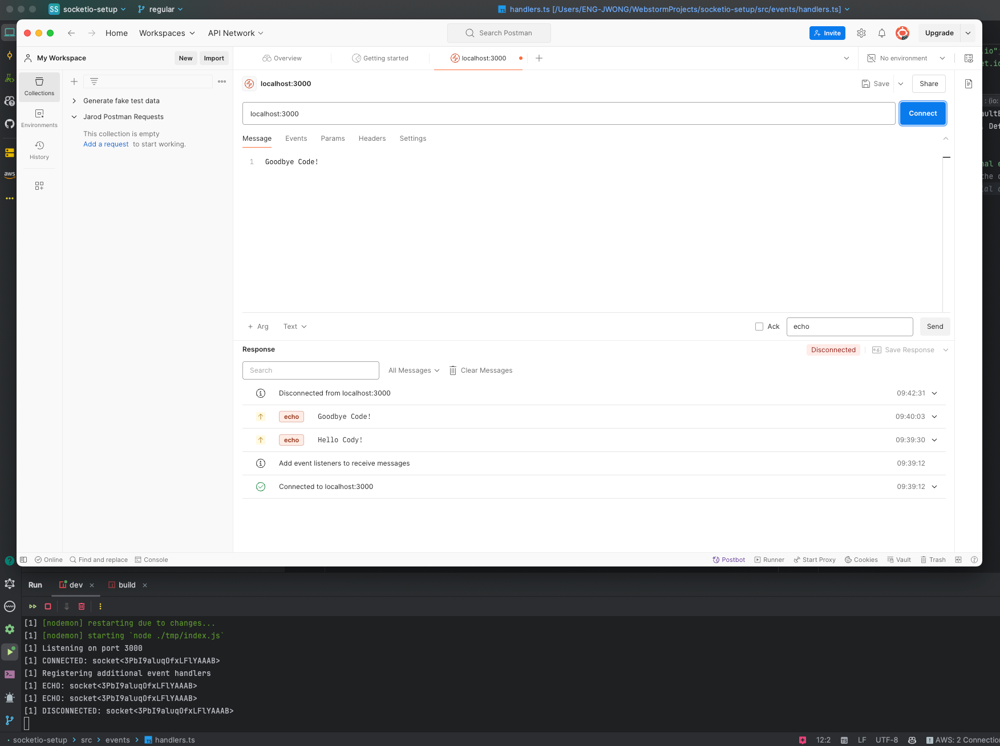

# Socket.IO Sever

```bash
# Build app to the build directory in JS (so that we can run it because TS doesn't run in Node)
npm run build

# Run app for development with auto-reloading enabled
npm run dev

# Run the app from the build folder
npm start
```



### TODO:

- [ ] Wrap every function's body in a try/catch block to prevent server
  shutdown.
- [ ] Add a logger to the server.
- [ ] Add environment variables locally to test AWS config in the **aws-cognito-auth** branch.
  - `PORT`, `AWS_COGNITO_USER_POOL_ID`, `AWS_COGNITO_CLIENT_ID`, `AWS_REGION`, `AWS_ACCESS_KEY_ID`, `AWS_SECRET_ACCESS_KEY`
